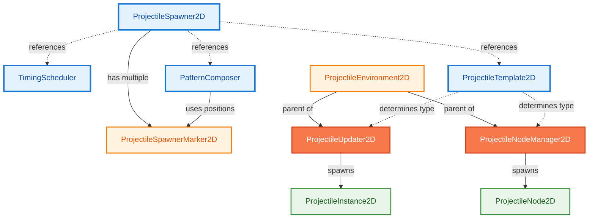
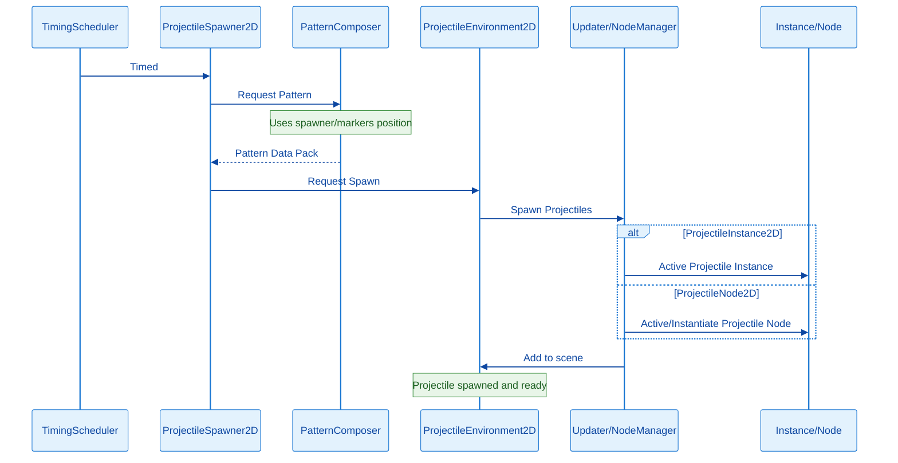

# How Godot Projectile Engine Works

This section will provide information on how the Godot Projectile Engine works at both a high and low level. Understanding these concepts will help you use the add-on more easily.

## High-Level

The Godot Projectile Engine uses **ProjectileTemplate2D** to determine what projectile to spawn, whether it's a **ProjectileInstance2D** or a **ProjectileNode2D**. When the **TimingScheduler** is timed, the **PatternComposer** will process and provide data to the **ProjectileSpawner2D**, which will then call a corresponding **ProjectileUpdater2D** or **ProjectileNodeManager2D** in the **ProjectileEnvironment2D** to instantiate new projectiles to the scene.

The **ProjectileSpawner2D** acts as the manager that holds references to the **ProjectileTemplate2D**, **PatternComposer**, and **TimingScheduler**.

The **ProjectileEnvironment2D** is the parent node for the **ProjectileUpdater2D** or **ProjectileNodeManager2D**, which is where the projectiles are

The **PatternComposer** will use the **ProjectileSpawner2D**'s position to define where projectiles will spawn. A **ProjectileSpawner2D** can also have multiple **ProjectileSpawnerMarker2D**s.

### **Reference Chart**

### **Logic Chart**

## Low-level

(*Documentation in progress*)